# 🏘️ LokLink (लोकलिंक)


> Your community, beautifully connected.

LokLink is a modern community management platform built to connect residents of townships, societies, campuses, and gated communities through one unified platform.

Originally designed for **BHEL Haridwar Township**, LokLink can easily be adapted for any residential community.

---

## ✨ Features

### 📰 Community Feed
- Share announcements
- Like, comment and engage
- Trending tags
- Admin notices

### 🔍 Lost & Found
- Report lost items
- Found item listings
- Contact owner
- Status filtering

### 🛒 Marketplace
- Buy & Sell items
- Category filters
- Product listings
- Seller chat

### 📢 Community Updates
- Official notices
- Pinned announcements
- Maintenance alerts
- Safety notifications

### 📅 Events
- Interactive calendar
- Event listings
- RSVP support
- Upcoming events

### 💬 Messenger
- Community messaging
- Group chats
- Real-time style interface

### 👥 Clubs
- Join interest groups
- Create clubs
- View members

### 🚨 Emergency
- Medical contacts
- Security contacts
- Fire contacts
- One-tap emergency numbers

### 🧭 Navigation
- Local places
- Hospitals
- Schools
- Markets
- Parks

### 👤 User Profile
- Activity history
- Listings
- Community contribution

### 🛡️ Admin Dashboard
- Member management
- Reports moderation
- Role management
- Community statistics

---

# 🛠 Tech Stack

## Frontend

- React
- TypeScript
- Vite
- Tailwind CSS
- React Router

## Backend (Planned)

- Node.js
- Express.js
- MongoDB
- JWT Authentication
- Cloudinary
- Socket.io

---

# 📸 Screenshots

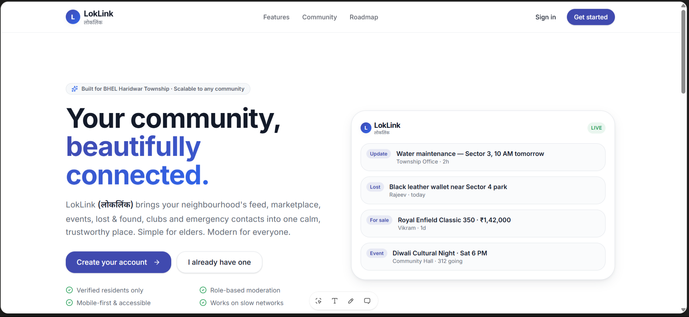
![LoginPage] (assets/screenshots/Login.png "Login Page")
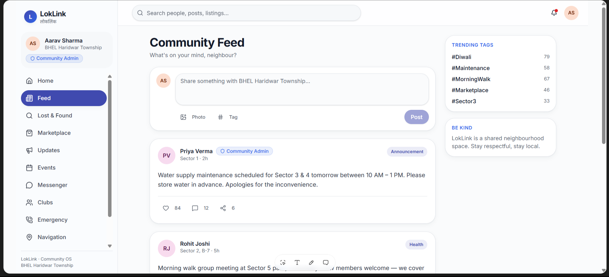
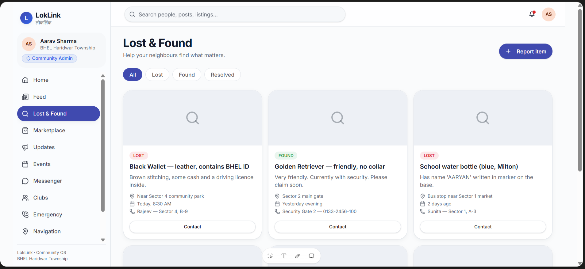
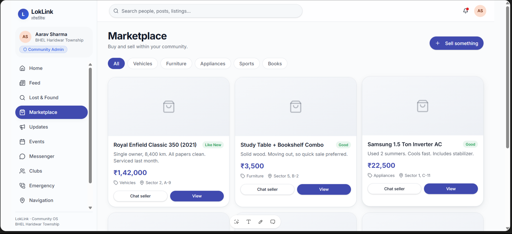
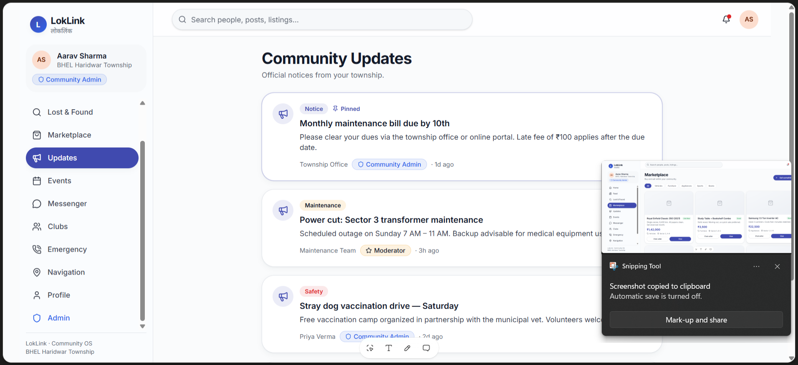
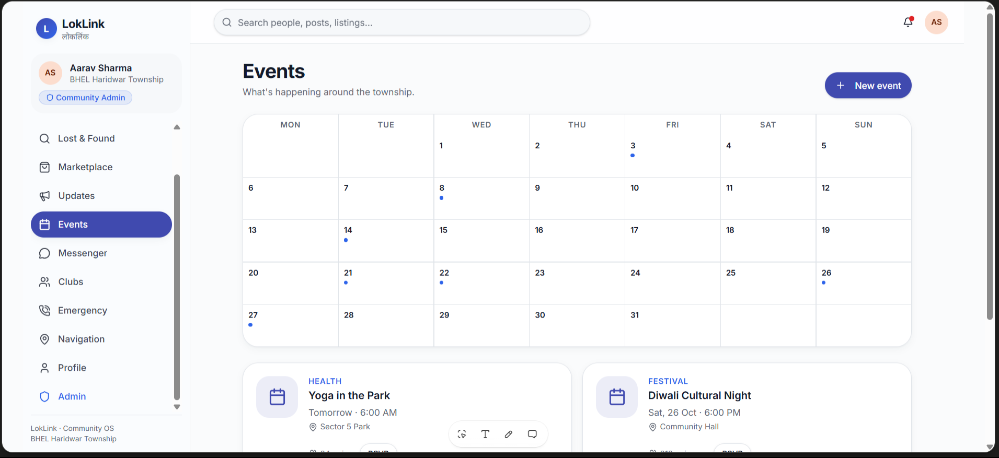
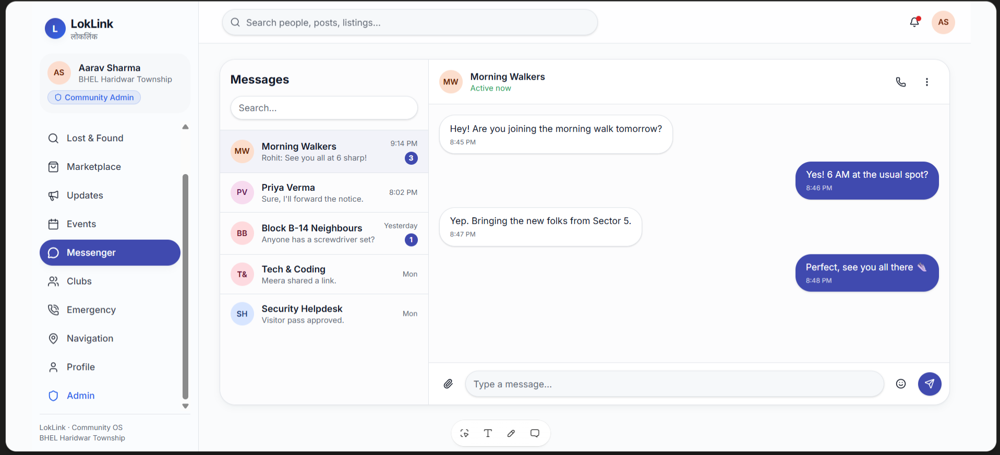
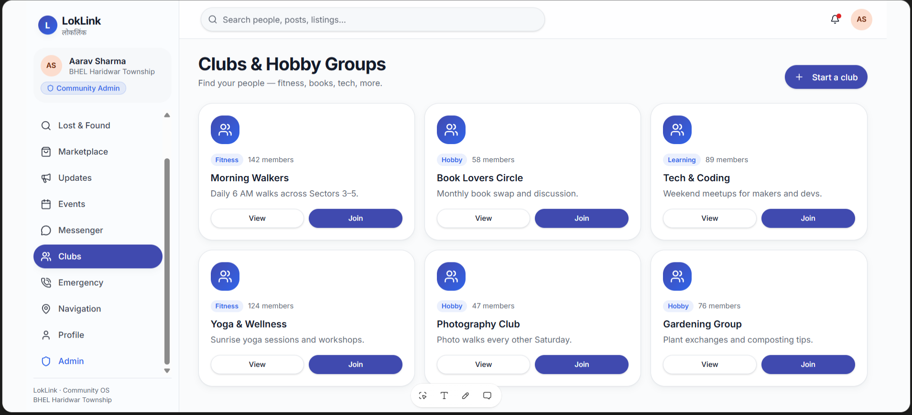
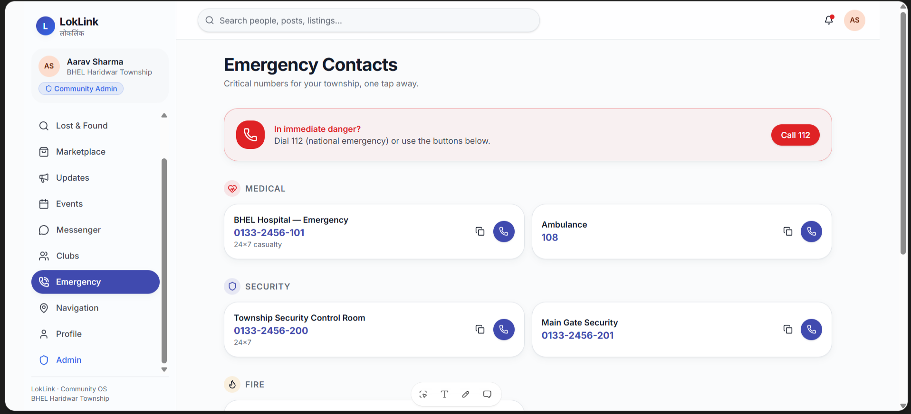
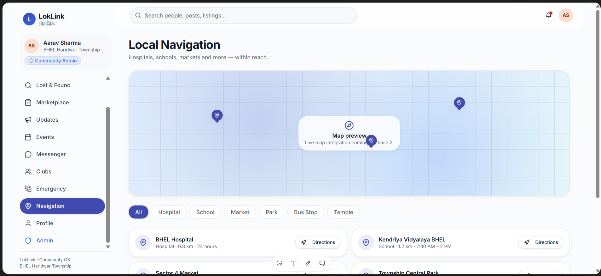
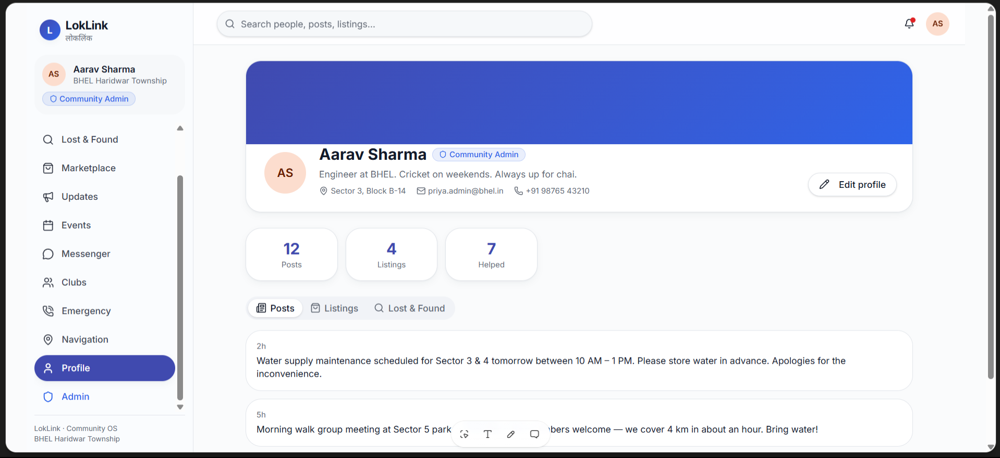
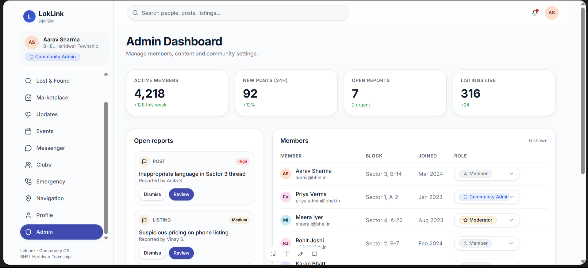

---

# 📂 Project Structure

```
LokLink
│
├── backend/          # Express Backend (Phase 2)
├── public/
├── src/
├── components/
├── hooks/
├── pages/
├── assets/
├── package.json
├── vite.config.ts
└── README.md
```

---

# 🚧 Current Status

## ✅ Completed

- Landing Page
- Authentication UI
- Home Dashboard
- Community Feed
- Lost & Found
- Marketplace
- Community Updates
- Events
- Messenger
- Clubs
- Emergency Contacts
- Navigation
- Profile
- Admin Dashboard

---

## 🔜 Upcoming

- MongoDB Integration
- Authentication
- User Registration
- Image Upload
- Notifications
- Live Chat
- Maps Integration
- Payment Support

---

# 🎯 Vision

LokLink aims to become a digital operating system for communities where residents can communicate, trade, organize events, report issues, and access important services from a single platform.

---

# 👨‍💻 Author

# 👥 Project Team

| Name | Role | Institute | GitHub |
|------|------|-----------|--------|
| **Malay Kumar Jha** | Lead Developer | UIET, Panjab University (BE CSE, 4th Year) | https://github.com/Mkjha101 |
| **Harsh Garg** | Frontend Developer | Chandigarh University (B.Tech CSE, 3rd Year) | https://github.com/HarshGarg0001 |

---

# 📄 License

Licensed under the MIT License.